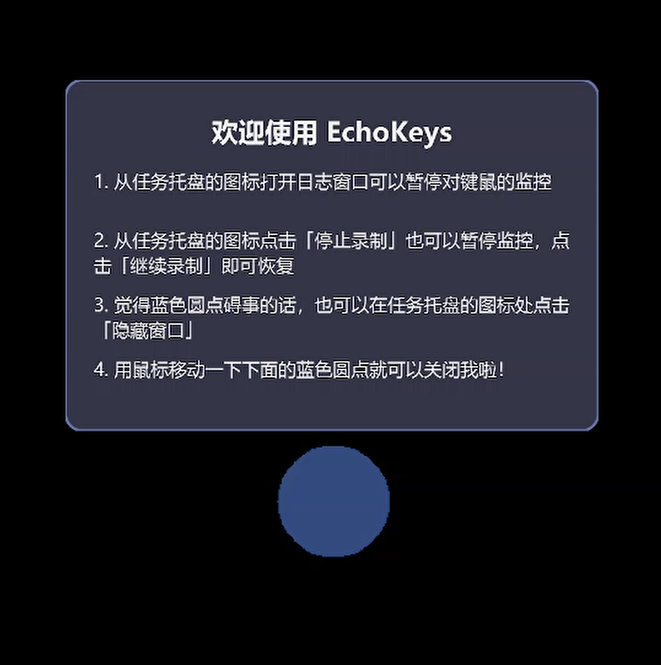
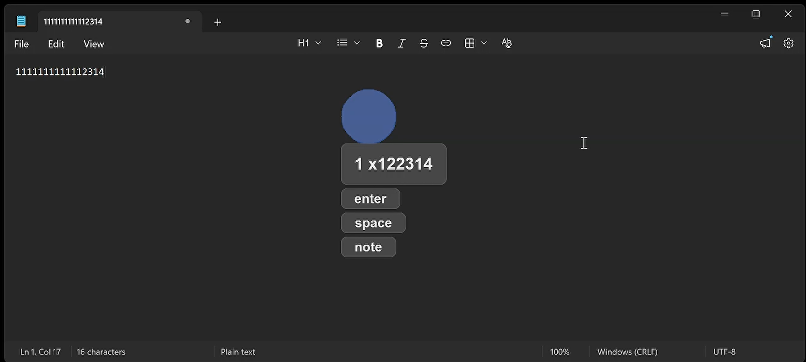
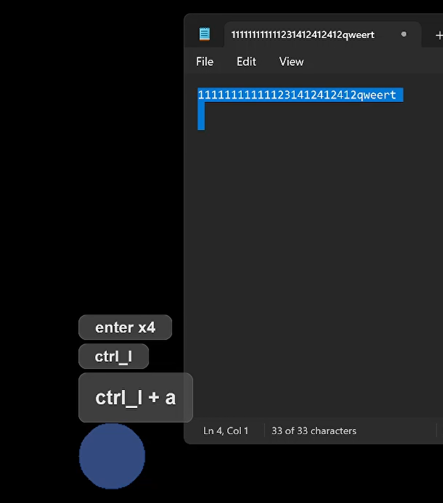
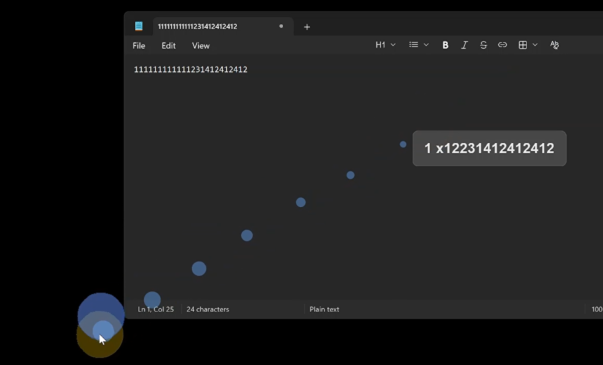
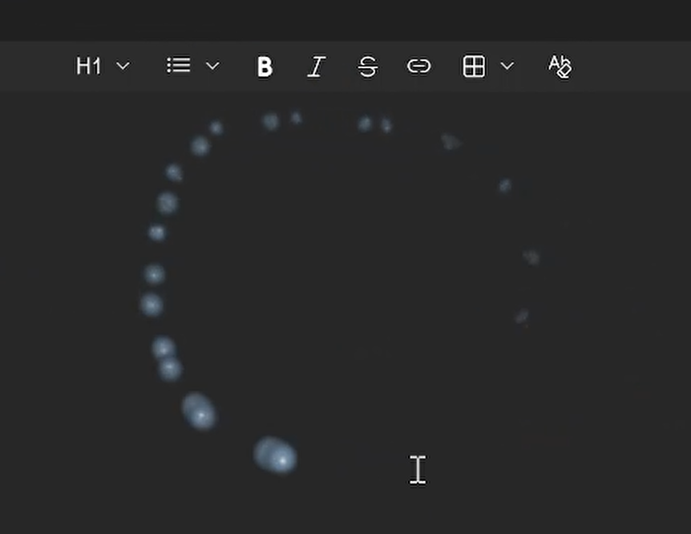
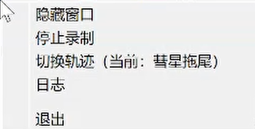

# EchoKeys

一款专为计算机教学演示设计的键鼠操作可视化工具：按键、鼠标操作、鼠标轨迹实时可视，让观众清晰看到演示者的每一次操作。

## 演示效果

### 启动欢迎提示

程序启动后会在蓝色圆点上方显示欢迎气泡，提示 3 条关键使用技巧（移动蓝色圆点即可关闭）。



### 按键可视化

按下的按键即时显示在屏幕上：最新记录大字体高亮，历史记录最多保留 6 条，5 秒自动消失；快速连续输入自动合并，连续重复按键显示计数（如 `space x3`）。



### 组合键识别

自动识别并显示 `ctrl + c`、`ctrl + shift + s` 等组合键（追踪 ctrl/shift/alt 等修饰键的按住状态），支持符号键与小键盘。



### 鼠标轨迹特效

提供两种可切换的鼠标轨迹方案（托盘菜单「切换轨迹」一键切换），均置顶显示且完全鼠标穿透，不影响任何正常操作。

**打水漂落点（默认方案）**：鼠标每累计移动约 2.5cm 落下一个淡蓝色半透明圆点（直径约 1cm），圆点随时间缩小消散；圆点尺寸与落点间距按所在屏幕 DPI 动态换算，不同缩放下物理观感一致。



**彗星粒子拖尾（备选方案）**：以淡蓝色彗星状粒子轨迹实时跟随鼠标，移动越快拖尾越密集，停止后自然收尾消散，基于 QOpenGLWidget + PyOpenGL 渲染。



### 系统托盘

程序常驻系统托盘：左键单击图标切换蓝色圆点显示/隐藏；右键菜单提供全部快捷操作。



右键菜单（自上而下）：

| 菜单项 | 说明 |
|--------|------|
| 显示窗口 / 隐藏窗口 | 单个切换按钮，文案随蓝色圆点实际显示状态实时同步 |
| 停止录制 / 继续录制 | 切换键鼠监控；此处主动停止后，开关日志窗口也不会自动恢复录制 |
| 切换轨迹 | 在「打水漂落点（默认）」与「彗星粒子拖尾」之间切换，两套效果互斥不叠加 |
| 日志 | 打开日志窗口（打开时自动暂停监控，关闭后恢复） |
| 退出 | 隐藏托盘图标并退出程序 |

## 功能特性

### ⌨️ 按键可视化
- **实时显示**：按下的按键即时显示在屏幕上
- **组合键识别**：`ctrl + c`、`ctrl + shift + s` 等
- **智能合并**：1 秒内连续输入的字母、数字、符号键自动合并
- **连续按键计数**：`space x3`、`a x5` 等计数格式
- **历史记录**：最多保留最近 6 条，5 秒后自动消失
- **特殊按键**：`tab`、`escape`、`f1-f12`、方向键、NumPad 数字与运算符等

### 🖱️ 鼠标可视化
- **点击弹窗**：按键与点击事件以弹窗形式展示，滚轮显示 `[滚轮] 上滚 x5` 等计数
- **鼠标高亮**：左键黄色、右键粉色、双键蓝色圆形高亮跟随光标，释放即消失
- **鼠标轨迹**：打水漂落点 / 彗星粒子拖尾两种方案可切换（见上文演示）

### 🔵 蓝色圆点悬浮窗
- 可拖拽、始终置顶，作为弹窗显示的锚点
- 点击圆点内部不产生操作记录；拖动圆点自动关闭欢迎提示

### 📝 日志窗口
- **彩色日志**：键盘按下（绿）、键盘释放/鼠标点击（浅蓝）、鼠标释放（浅红）、滚轮（橙）
- **暂停联动**：打开日志窗口自动暂停监控，关闭后自动恢复；托盘「停止录制」的优先级更高
- **完整历史**：运行期间全部事件带毫秒级时间戳记录，打开时一次性载入

### 🖥️ 高 DPI 支持
- 自动启用高 DPI 缩放与高 DPI 图标
- 物理坐标到 Qt 逻辑坐标自动转换
- 轨迹特效的尺寸按屏幕 DPI 物理换算（厘米↔像素），多屏/多缩放下观感一致

## 安装

### 环境要求
- Python 3.8+
- Windows 系统（推荐）

### 依赖包
- **PyQt5** (5.15.11) - GUI 框架
- **pynput** (1.8.2) - 键鼠监听库
- **PyOpenGL** (3.1.10) - 彗星拖尾的 OpenGL 渲染

> 国内网络建议使用镜像源安装，如：`pip install -r requirements.txt -i https://pypi.tuna.tsinghua.edu.cn/simple`

## 使用方法

**方法一：启动器（推荐）**

`boot.py` 会自动创建/校验虚拟环境、检测依赖变更并增量安装（失败自动重试 3 次），随后在后台无控制台窗口启动程序：

```bash
python boot.py
```

**方法二：手动运行**

```bash
pip install -r requirements.txt
python EchoKeys.py
```

**打包为 exe**（PyInstaller）：

```bash
pip install pyinstaller
pyinstaller EchoKeys.spec --noconfirm
# 产物位于 dist/EchoKeys/EchoKeys.exe
```

### 教学演示使用技巧

1. 启动后将蓝色圆点拖到不遮挡演示内容的位置（如屏幕角落）
2. 正常操作即可，按键与鼠标动作自动显示
3. 蓝色圆点碍事时，托盘左键单击或菜单「隐藏窗口」即可隐藏
4. 需要回顾操作细节时打开日志窗口（注意会暂停监控）
5. 托盘菜单「切换轨迹」可按喜好选择落点式或彗尾式轨迹

## 项目结构

```
EchoKeys/
├── EchoKeys.py                   # 主程序入口（CircleWindow + 事件协调 + 托盘菜单）
├── boot.py                       # 智能启动器（虚拟环境管理 + 后台运行）
├── EchoKeys.spec                 # PyInstaller 打包配置
├── requirements.txt              # 依赖列表（PyQt5 + pynput + PyOpenGL）
├── README.md
├── LICENSE                       # MIT 许可证
├── assets/                       # 演示图片
│   └── images/202609/
│
├── tools/                        # 核心工具模块
│   ├── Dialog.py                 # 操作记录显示窗口
│   ├── Log.py                    # 日志查看窗口（window_opened/closed 信号）
│   ├── ToolTip.py                # 欢迎提示气泡
│   ├── key_mouse_monitor.py      # 键鼠事件监听器（pynput 封装，QObject 信号）
│   ├── mouse_highlight.py        # 鼠标按键高亮窗口
│   ├── mouse_trail.py            # 彗星粒子拖尾（QOpenGLWidget + PyOpenGL）
│   └── water_skip.py             # 打水漂落点效果（QPainter + 对象池，默认方案）
│
└── test/                         # 开发测试文件（非运行必需）
```

## 模块说明

### EchoKeys.py（主程序）
- **CircleWindow**：可拖拽蓝色圆点（80x80），带 `position_changed` / `visibility_changed` 信号
- **事件协调**：连接 `KeyMouseMonitor` 全部信号到各显示窗口；管理弹窗的合并、计数与定位
- **托盘菜单**：显示/隐藏切换（信号驱动文案同步）、停止/继续录制（按钮停止优先级高于日志联动）、切换轨迹（两方案互斥启停）、日志、退出

### tools/key_mouse_monitor.py（键鼠监听）
- **KeyMouseMonitor(QObject)**：基于 pynput，发射 `key_pressed`、`mouse_pressed`、`mouse_scrolled`、`mouse_moved`、`left/right_pressed/released` 等信号
- 组合键识别：`pressed_keys` 集合追踪修饰键；虚拟键码映射 A-Z、0-9、符号

### tools/mouse_trail.py（彗星粒子拖尾，备选方案）
- **MouseTrailWindow(QOpenGLWidget)**：全屏透明置顶 overlay，粒子系统（速度驱动生成、阻尼/上浮/寿命衰减），淡蓝色软圆光斑 over 混合渲染
- `start_trail()` / `stop_trail()`：启停接口，与打水漂方案互斥切换

### tools/water_skip.py（打水漂落点，默认方案）
- **RippleController(QObject)**：16ms 轮询全局鼠标位置，累计位移达到阈值（2.5cm）落点
- **RippleDotWindow**：圆点窗口对象池（预创建 10 个，FIFO 复用），独立定时器驱动缩小动画，Win32 扩展样式实现跨进程鼠标穿透
- cm↔px 按鼠标所在屏 `logicalDotsPerInch()` 动态换算

### tools/Dialog.py / Log.py / ToolTip.py / mouse_highlight.py
- **DialogWindow**：操作记录弹窗（置顶、穿透、自动销毁）
- **LogWindow**：深色日志窗口，`window_opened`/`window_closed` 信号驱动监控暂停/恢复
- **ToolTipWindow**：欢迎提示气泡
- **MouseHighlightWindow**：鼠标按键彩色高亮

## 技术实现

- **GUI 框架**：PyQt5 5.15.11（Signal/Slot 机制实现模块间解耦）
- **键鼠监听**：pynput 1.8.2（全局钩子 + 信号转发到主线程）
- **轨迹渲染**：
  - 打水漂：纯 QPainter 光栅渲染 + Win32 分层窗口穿透
  - 彗星拖尾：QOpenGLWidget + PyOpenGL 固定管线（透明 overlay 合成、over 混合防加法饱和）
- **窗口特性**：无边框、置顶、鼠标穿透（`Qt.WindowTransparentForInput` + `WA_TransparentForMouseEvents`）、显示不抢前台（防任务栏闪烁/系统通知）
- **打包**：PyInstaller（EchoKeys.spec，含 hiddenimports 与模块裁剪）

## 应用场景

- 软件操作教学视频录制
- 远程技术支持演示
- 编程教学直播
- 快捷键操作演示
- 任何需要展示键鼠操作的场合

## License

MIT
